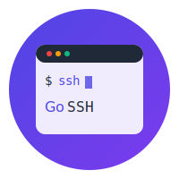

# GoSSH-Web

<div align="center">



[](https://golang.org/doc/devel/release.html)
[](LICENSE)
[](CONTRIBUTING.md)

*🚀 强大而现代的Web终端解决方案*

[English](README_EN.md) | 简体中文

</div>

## 📖 简介

GoSSH-Web 是一个基于Web的SSH终端工具，使用Go语言开发。它提供了一个现代化的Web界面，允许用户通过浏览器安全地连接和管理SSH服务器。项目专注于提供流畅的终端体验和强大的会话管理功能。

## ✨ 功能特点

- 🌈 现代化的Web终端界面，基于xterm.js
- ⚡️ 实时命令执行和响应，支持WebSocket
- 🔐 支持SSH密码认证和会话加密
- 🔄 智能会话持久化和自动重连
- 📦 多会话管理和状态监控
- ⌨️ 完整的终端快捷键支持
- 🔍 强大的终端输出搜索功能
- 📱 响应式设计，完美支持移动设备

## 🛠 技术栈

- **后端框架：** Go + Gin
- **前端技术：** 
  - HTML5 + JavaScript
  - xterm.js 终端模拟
  - WebSocket 实时通信
  - Bootstrap 5 响应式界面
- **核心功能：**
  - SSH协议支持
  - PTY（伪终端）支持
  - 会话持久化
  - 实时数据传输

## 🚀 快速开始

### 环境要求

- Go 1.21+
- 现代浏览器（Chrome、Firefox、Edge等）

### 安装步骤

1. 克隆项目
   ```bash
   git clone https://github.com/MoTeam-cn/GoSSH-Web.git
   cd GoSSH-Web
   ```

2. 安装依赖
   ```bash
   go mod tidy
   ```

3. 运行服务器
   ```bash
   go run main.go
   ```

4. 访问应用
   打开浏览器访问 http://localhost:8080

## 💡 使用指南

### 基本使用

1. **连接服务器**
   - 输入服务器信息（主机、端口、用户名、密码）
   - 点击"连接"按钮

2. **终端操作**
   - 支持所有标准终端操作
   - 常用快捷键支持
   - 终端输出搜索
   - 一键清屏

3. **会话管理**
   - 自动保存连接配置
   - 智能断线重连
   - 多会话并行处理
   - 连接状态实时显示

### 高级功能

- **终端自定义**
  - 字体和颜色设置
  - 终端大小调整
  - 快捷键配置

- **安全特性**
  - HTTPS/WSS支持
  - 数据加密传输
  - 会话超时处理

## 🔒 安全说明

- 强烈建议在生产环境启用HTTPS
- 所有敏感信息使用TLS加密传输
- 支持会话超时自动断开
- 建议配置访问控制和认证机制

## 🗺 开发路线图

### 近期计划
- [ ] SSH密钥认证支持
- [ ] 终端分屏功能
- [ ] 文件传输系统
- [ ] 会话录制与回放

### 长期目标
- [ ] 终端主题市场
- [ ] 插件系统
- [ ] 用户认证系统
- [ ] 集群管理支持

## 🤝 贡献指南

我们欢迎各种形式的贡献，包括但不限于：

- 提交问题和建议
- 改进文档
- 提交代码改进
- 分享使用经验

请查看 [CONTRIBUTING.md](CONTRIBUTING.md) 了解详细信息。

## 📄 许可证

本项目采用 MIT 许可证 - 查看 [LICENSE](LICENSE) 文件了解详细信息。

## 🙏 致谢

感谢所有为本项目做出贡献的开发者！

---

<div align="center">

如果这个项目对你有帮助，请考虑给它一个星标 ⭐️

</div> 